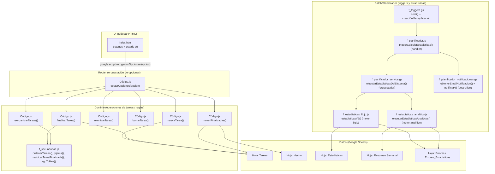

# Arquitectura — Gestión_Tareas_Susi (Google Apps Script)

## Alcance y artefactos del repo

Este proyecto es un Google Apps Script asociado a una hoja de cálculo (Spreadsheet) y con UI de barra lateral (HTML) que invoca funciones del servidor (Apps Script) para gestionar tareas y ejecutar estadísticas.

- EVIDENCIA: `appsscript.json` → `webapp.executeAs/access` → `executeAs: USER_DEPLOYING` y `access: MYSELF` (webapp restringida al propietario del despliegue).
- EVIDENCIA: `Código.js` → `mostrarBarraLateral()` → `ui_renderHtml('index')` + `SpreadsheetApp.getUi().showSidebar(...)` (render robusto DES/PRO).
- EVIDENCIA: `index.html` → `startAction(opcion)` → `google.script.run...gestorOpciones(opcion)` (contrato cliente→servidor).

## Arquitectura UI actual (Sidebar vs Modales)

El proyecto usa **dos patrones UI** que deben permanecer diferenciados:

1) **Sidebar (navegación operativa diaria)**
- Renderiza `index.html`.
- Dentro del sidebar existe navegación de “paneles” mediante carga dinámica (`obtenerHtml(nombre)` → inyección en `#contenedor`).
- Es el patrón correcto para operaciones de tareas (opciones 1..6).

2) **Modales HtmlService (paneles administrativos / dashboards)**
- Se abren como ventana flotante sobre Google Sheets mediante `SpreadsheetApp.getUi().showModalDialog(...)`.
- Patrón usado por:
  - **Dashboard estadísticas** (modal).
  - **Gestión de Triggers** (`panelTriggers`) (modal).
  - **Configuración de notificaciones** (`modalConfiguracionNotificaciones`) (modal).
- Objetivo: evitar incrustar pantallas administrativas dentro del sidebar y mantener consistencia visual/arquitectónica.

## Capas (lógicas) del sistema

EVIDENCIAS clave de capa:
- EVIDENCIA: `index.html` → `startAction(opcion)` → `google.script.run...gestorOpciones(opcion)` (UI).
- EVIDENCIA: `Código.js` → `gestorOpciones(opcion)` → `switch (opcion) { case 1..6 }` (router).
- EVIDENCIA: `Código.js` → `nuevaTarea()/finalizarTarea()/borrarTarea()/reactivarTarea()/reorganizarTareas()/moverFinalizadas()` → operaciones sobre `SpreadsheetApp`.
- EVIDENCIA: `f_triggers.gs` → `crearTriggerDesdeConfig(config)` → `ScriptApp.newTrigger('triggerCalculoEstadisticas').timeBased()...create()` (batch).

## Inventario del sistema (archivo → responsabilidades → hojas → APIs)

| Archivo | Responsabilidades verificables | Hojas Google Sheets usadas | APIs Apps Script usadas |
|---|---|---|---|
| `appsscript.json` | Configuración runtime V8, timezone, webapp access/executeAs | N/A | N/A |
| `.clasp.json` | Vinculación local con Script ID y rootDir | N/A | N/A |
| `index.html` | UI: botones 1..6, estado UI, invocación `gestorOpciones` con `google.script.run` | N/A | `google.script.run` (cliente HTML) |
| `Código.js` | Menú `onOpen`, sidebar, router `gestorOpciones`, CRUD y reorganización de tareas, mover finalizadas | `Tareas`, `Hecho` | `SpreadsheetApp`, `HtmlService`, `Session`, `Utilities` |
| `f_secundarias.js` | Ordenación (`ordenarTareas`), coloreado pijama/vence (`pijama`), reubicar fila finalizada (`reubicarTareaFinalizada`), util color (`rgbToHex`) | hoja activa (implícito), `Tareas` (vía hoja activa) | `SpreadsheetApp` (implícito por hoja activa) |
| `f_estadisticas_flujo.js` | Generación hoja `Estadisticas`, lectura datos de `Tareas`/`Hecho`, agregación por semana ISO, hoja de errores dedicada | `Estadisticas`, `Tareas`, `Hecho`, `Errores_Estadisticas` | `SpreadsheetApp` |
| `f_estadisticas_analitico.js` | Resumen semanal alternativo: crea/borra `Resumen Semanal`, `Errores`; procesa 1..2 hojas de entrada | `Resumen Semanal`, `Errores`, `Tareas`, `Hecho` | `SpreadsheetApp` |
| `f_triggers.gs` | Configuración centralizada de triggers (ScriptProperties), validación, creación/deduplicación | N/A | `ScriptApp`, `PropertiesService`, `Logger` |
| `f_triggers_api.gs` | API backend para UI de triggers (obtener/guardar/recrear/inicializar) | N/A | `PropertiesService` |
| `panelTriggers.html` + `panelTriggers_script.html` | UI administrativa para gestionar triggers (modal) | N/A | `google.script.run` (cliente HTML) |
| `f_planificador_service.gs` | Orquestador principal de estadísticas del sistema (`ejecutarEstadisticasDelSistema`) | `Estadisticas`, `Resumen Semanal`, `Errores*` (indirecto) | `SpreadsheetApp` (indirecto vía módulos), `PropertiesService` (indirecto vía dashboard) |
| `f_planificador_notificaciones.gs` | Notificaciones email (best-effort) basadas en `EMAIL_NOTIFICACION` | N/A | `MailApp`, `PropertiesService`, `Logger` |
| `f_planificador.js` | Handler del trigger (`triggerCalculoEstadisticas`) como wrapper: delega cálculo y notificación | N/A (indirecto) | `Logger` |

EVIDENCIA por archivo (ejemplos auditables):
- EVIDENCIA: `Código.js` → `onOpen()` → `SpreadsheetApp.getUi().createMenu('Lista Tareas')...addItem('Mostrar Barar Lateral', 'mostrarBarraLateral')`.
- EVIDENCIA: `Código.js` → `moverFinalizadas()` → lee `Tareas`, escribe `Hecho`, y borra filas en `Tareas`.
- EVIDENCIA: `f_estadisticas_flujo.js` → `prepararHojaEstadisticas()` → `tareas = obtenerDatosHoja("Tareas"); hechos = obtenerDatosHoja("Hecho");`.

## Flujo end-to-end (resumen)

1) Usuario abre Spreadsheet → se ejecuta `onOpen()` y se crea el menú.
- EVIDENCIA: `Código.js` → `onOpen()` → `SpreadsheetApp.getUi().createMenu(...)`.

2) Usuario abre la barra lateral → `mostrarBarraLateral()` renderiza `index.html`.
- EVIDENCIA: `Código.js` → `mostrarBarraLateral()` → `ui_renderHtml('index')`.

3) Usuario pulsa un botón (1..6) → `index.html` llama a `gestorOpciones(opcion)`.
- EVIDENCIA: `index.html` → `startAction(opcion)` → `.gestorOpciones(opcion)`.

4) `gestorOpciones` enruta al caso correspondiente (Nueva/Finalizar/Reactivar/Borrar/Reorganizar/Mover Finalizados).
- EVIDENCIA: `Código.js` → `gestorOpciones(opcion)` → `switch (opcion) { case 1..6 }`.

5) Operaciones modifican hojas (`Tareas`, `Hecho`) y aplican orden/colores.
- EVIDENCIA: `Código.js` → `reorganizarTareas()` → `rngTareas.setValues(tablafinal); pijama();`.

6) Batch (trigger) ejecuta estadísticas y notifica por email.
- EVIDENCIA: `f_planificador.js` → `triggerCalculoEstadisticas()` → `ejecutarCalculoEstadisticas()` + `notificarExito()`/`notificarError(error)` (best-effort).
- EVIDENCIA: `f_planificador_service.gs` → `ejecutarEstadisticasDelSistema()` → orquesta flujo + analítico + toast + alertas proactivas.

Detalles técnicos por flujo y columnas implicadas: ver `docs/FLOWS.md` y `docs/DATA_MODEL.md`.

## Decisiones técnicas observables (no inferidas)

- **UI mínima en HTML**: botones con `onclick="startAction(n)"`, sin dependencias externas.
  - EVIDENCIA: `index.html` → botones `Nueva Tarea`..`Mover Finalizados` → `startAction(1..6)`.
- **Orquestación por entero `opcion`**: evita múltiples endpoints; un único punto de entrada.
  - EVIDENCIA: `Código.js` → `gestorOpciones(opcion)` → `switch (opcion)`.
- **Persistencia principal en Google Sheets + configuración operativa en ScriptProperties**:
  - Triggers: ScriptProperty `TRIGGERS_CONFIG` (configuración centralizada).
  - Notificaciones: ScriptProperty `EMAIL_NOTIFICACION` (destinatario email; modo best-effort).
  - Dashboard: ScriptProperties para anti-spam/toast (p.ej. `ULTIMA_ALERTA_FECHA`, `ULTIMO_TOAST`).
  - EVIDENCIA: `f_triggers.gs` → `PropertiesService.getScriptProperties().setProperty('TRIGGERS_CONFIG', ...)`.
  - EVIDENCIA: `f_planificador_notificaciones.gs` → `PropertiesService.getScriptProperties().getProperty('EMAIL_NOTIFICACION')`.
  - EVIDENCIA: `f_estadisticas_dashboard.js` → ScriptProperties `ULTIMA_ALERTA_FECHA` / `ULTIMO_TOAST`.

Nota (UI dinámica y bundle):
- El sidebar carga paneles dinámicos mediante `obtenerHtml(nombre)` y ejecuta scripts embebidos en el HTML inyectado.
- El proyecto soporta:
  - **PRO/BUNDLE**: HTML embebido en el bundle y resuelto por `gasHtmlRawByName_(nombre)` (generado por el builder).
  - **DES (fuentes sueltas / despliegue parcial)**: HTML físico `.html` en `Gestion_Tareas_Susi/`.

## Renderizado HTML “oficial” del proyecto (contrato DES vs PRO/BUNDLE)

### Problema que resuelve

En modo **BUNDLE**, `HtmlService.createHtmlOutputFromFile(...)` / `createTemplateFromFile(...)` fallan porque los `.html` no existen como archivos “sueltos” en runtime (están embebidos en `dist/app.bundle.gs`). Esto fue la causa del error operativo:

- `Exception: No se ha encontrado el archivo HTML denominado index.`

Además, si se entrega HTML como “texto” (p.ej. `getContent()` sin evaluar template), los includes aparecen impresos literal:

- `<?!= include('...') ?>`

### Wrappers core (obligatorios)

Estos helpers son el **punto único** para evitar divergencias DES/PRO:

- **`ui_htmlRawByName_(nombreArchivo)`** (`uiRepository.gs`)
  - **Qué hace**: devuelve el HTML raw (string) resolviendo:
    - **PRO/BUNDLE**: `gasHtmlRawByName_(nombre)` (HTML embebido).
    - **DES**: `HtmlService.createHtmlOutputFromFile(nombre).getContent()` (archivo físico).
  - **Uso recomendado**: dentro de `include(filename)` o cuando se necesite el contenido raw.

- **`ui_renderHtml(nombreArchivo)`** (`uiRepository.gs`)
  - **Qué hace**: devuelve `HtmlOutput` evaluando como **Template** para que se procesen `<?= ?>` / `<?!= include(...) ?>`:
    - **PRO/BUNDLE**: `HtmlService.createTemplate(gasHtmlRawByName_(nombre)).evaluate()`
    - **DES**: `HtmlService.createTemplateFromFile(nombre).evaluate()`
  - **Uso recomendado**: cualquier `showSidebar(...)` o `showModalDialog(...)`.

### Reglas arquitectónicas obligatorias (anti‑regresión)

- **NO** usar `gasHtmlRawByName_` directamente en módulos funcionales.
  - Motivo: acopla el código a BUNDLE y rompe DES/diagnóstico.
- **NO** usar `HtmlService.createHtmlOutputFromFile(...)` para vistas/paneles del proyecto (excepto dentro de wrappers como fallback DES).
  - Motivo: rompe en BUNDLE.
- **NO** renderizar paneles con `HtmlService.createHtmlOutput(htmlString)` cuando existan includes/templating.
  - Motivo: los `<?!= ... ?>` se imprimen literal si no pasan por `Template.evaluate()`.
- **SÍ** usar:
  - Sidebar/modal: `ui_renderHtml('nombreHtml')`.
  - Includes: `include('vista_script')` → `ui_htmlRawByName_('vista_script')`.

## Cambio relevante: “Configuración notificaciones” (antes sidebar → ahora modal)

### Antes (patrón que causaba fricción)

- La vista se cargaba dentro del sidebar (vía `PAGINA_INICIAL` y/o inyección en `#contenedor`).
- Efecto: quedaba “incrustada” en el menú lateral, mezclando UI operativa con UI administrativa.

### Ahora (patrón oficial)

- `mostrarConfiguracionNotificacionesModal()` abre `modalConfiguracionNotificaciones.html` mediante `showModalDialog`.
- El modal incluye la vista y su script separado (`vistaConfiguracionNotificaciones.html` + `vistaConfiguracionNotificaciones_script.html`).
- Beneficios:
  - coherencia con dashboard/panelTriggers,
  - desacoplamiento del sidebar,
  - menos dependencia de CSS/DOM del sidebar,
  - reduce riesgos de regresión en navegación dinámica.

## Riesgos típicos y anti‑patrones (lecciones aprendidas)

1) **Includes impresos como literal**
- Síntoma: aparece `<?!= include('x') ?>` como texto.
- Causa: HTML entregado sin `Template.evaluate()`.
- Mitigación: renderizar con `ui_renderHtml(...)` (siempre).

2) **Divergencia DES/PRO por llamadas directas a HtmlService *FromFile**
- Síntoma: `No se ha encontrado el archivo HTML denominado ...` en PRO/BUNDLE.
- Causa: `createHtmlOutputFromFile` / `createTemplateFromFile` usado fuera del wrapper.
- Mitigación: wrappers core + mantener el contrato de uso.

3) **Dependencias bundle‑only ocultas**
- Síntoma: funciona en PRO pero falla en DES (o al revés).
- Causa: uso directo de `gasHtmlRawByName_` o suposiciones de bundle.
- Mitigación: `ui_htmlRawByName_`/`ui_renderHtml` como punto único.

## Riesgos operativos (documentados, NO corregidos)

1) **Manejo de excepciones defectuoso en `finalizarTarea`**: el `catch` captura `error` pero lanza `err.message` (variable no definida) → riesgo de ocultar el error real y disparar un nuevo error.
- EVIDENCIA: `Código.js` → `finalizarTarea()` → `} catch (error) { throw new Error(err.message); }`.

2) **`reactivarTarea` contiene inconsistencias de error/flush**:
   - `catch (err) { throw new Error(error.message); }` (variable `error` no definida en ese scope).
   - `SpreadsheetApp.flush;` sin invocación (falta `()`), por lo que no fuerza flush.
- EVIDENCIA: `Código.js` → `reactivarTarea()` → `throw new Error(error.message)` y `SpreadsheetApp.flush;`.

3) **Duplicación de función en estadísticas v2**: `grabarEnHjEstadisticas` está declarada dos veces; la segunda sobrescribe a la primera en tiempo de carga.
- EVIDENCIA: `f_estadisticas_flujo.js` → `grabarEnHjEstadisticas(valores)` → definiciones duplicadas (dos bloques con mismo nombre).

4) **Dependencia fuerte de tipos `Date` en celdas** en `moverFinalizadas`: usa `.getTime()` sobre `elemenIn[6]` y `elemenIn[0]`; si la hoja contiene strings (p.ej. importación o formato), fallará.
- EVIDENCIA: `Código.js` → `moverFinalizadas()` → `claveIn = \`${elemenIn[6].getTime()}|${elemenIn[1]}|${elemenIn[0].getTime()}\``.

5) **Notificaciones best-effort (dependen de configuración)**: si `EMAIL_NOTIFICACION` no está configurado, no se envía email (modo resiliente) y se registran warnings/logs.
- EVIDENCIA: `f_planificador_notificaciones.gs` → `obtenerEmailNotificacion()` devuelve `null` si no hay property; `notificar*()` registra warnings y no rompe ejecución.

Riesgos y mitigaciones operativas (sin cambiar código): ver `docs/SECURITY.md` y `docs/TROUBLESHOOTING.md`.

