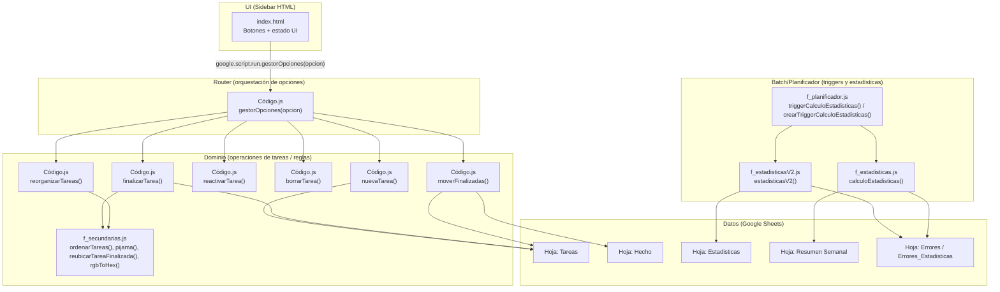

# Arquitectura — Gestión_Tareas_Susi (Google Apps Script)

## PLAN DE CORRECCIÓN (OBLIGATORIO)

- Ajustar `docs/FLOWS.md` y `docs/DATA_MODEL.md` para que `reactivarTarea` **no se documente como flujo desde `Hecho`**.
- Añadir en `docs/DATA_MODEL.md` una sección explícita de **columnas relativas** (p.ej. “última columna”, `numcolumnas - 3`) con mapeo a columnas concretas y evidencia.
- Corregir `docs/TROUBLESHOOTING.md` para incluir el caso operativo faltante relacionado con `moverFinalizadas` cuando no hay tareas en estado `'hecho'`.
- Ejecutar verificación de coherencia cruzada entre `docs/ARCHITECTURE.md`, `docs/DATA_MODEL.md` y `docs/FLOWS.md` manteniendo estructura y sin eliminar contenido válido.

## Alcance y artefactos del repo

Este proyecto es un Google Apps Script asociado a una hoja de cálculo (Spreadsheet) y con UI de barra lateral (HTML) que invoca funciones del servidor (Apps Script) para gestionar tareas y ejecutar estadísticas.

- EVIDENCIA: `appsscript.json` → `webapp.executeAs/access` → `executeAs: USER_DEPLOYING` y `access: MYSELF` (webapp restringida al propietario del despliegue).
- EVIDENCIA: `Código.js` → `mostrarBarraLateral()` → `HtmlService.createHtmlOutputFromFile('index')` + `SpreadsheetApp.getUi().showSidebar(...)`.
- EVIDENCIA: `index.html` → `startAction(opcion)` → `google.script.run...gestorOpciones(opcion)` (contrato cliente→servidor).

## Capas (lógicas) del sistema

EVIDENCIAS clave de capa:
- EVIDENCIA: `index.html` → `startAction(opcion)` → `google.script.run...gestorOpciones(opcion)` (UI).
- EVIDENCIA: `Código.js` → `gestorOpciones(opcion)` → `switch (opcion) { case 1..6 }` (router).
- EVIDENCIA: `Código.js` → `nuevaTarea()/finalizarTarea()/borrarTarea()/reactivarTarea()/reorganizarTareas()/moverFinalizadas()` → operaciones sobre `SpreadsheetApp`.
- EVIDENCIA: `f_planificador.js` → `crearTriggerCalculoEstadisticas()` → `ScriptApp.newTrigger('triggerCalculoEstadisticas').timeBased()...create()` (batch).

## Inventario del sistema (archivo → responsabilidades → hojas → APIs)

| Archivo | Responsabilidades verificables | Hojas Google Sheets usadas | APIs Apps Script usadas |
|---|---|---|---|
| `appsscript.json` | Configuración runtime V8, timezone, webapp access/executeAs | N/A | N/A |
| `.clasp.json` | Vinculación local con Script ID y rootDir | N/A | N/A |
| `index.html` | UI: botones 1..6, estado UI, invocación `gestorOpciones` con `google.script.run` | N/A | `google.script.run` (cliente HTML) |
| `Código.js` | Menú `onOpen`, sidebar, router `gestorOpciones`, CRUD y reorganización de tareas, mover finalizadas | `Tareas`, `Hecho` | `SpreadsheetApp`, `HtmlService`, `Session`, `Utilities` |
| `f_secundarias.js` | Ordenación (`ordenarTareas`), coloreado pijama/vence (`pijama`), reubicar fila finalizada (`reubicarTareaFinalizada`), util color (`rgbToHex`) | hoja activa (implícito), `Tareas` (vía hoja activa) | `SpreadsheetApp` (implícito por hoja activa) |
| `f_estadisticasV2.js` | Generación hoja `Estadisticas`, lectura datos de `Tareas`/`Hecho`, agregación por semana ISO, hoja de errores dedicada | `Estadisticas`, `Tareas`, `Hecho`, `Errores_Estadisticas` | `SpreadsheetApp` |
| `f_estadisticas.js` | Resumen semanal alternativo: crea/borra `Resumen Semanal`, `Errores`; procesa 1..2 hojas de entrada | `Resumen Semanal`, `Errores`, `Tareas`, `Hecho` | `SpreadsheetApp` |
| `f_planificador.js` | Trigger time-based para ejecutar estadísticas y envío email de estado; util para listar triggers | N/A (indirecto vía funciones llamadas) | `ScriptApp`, `MailApp`, `Logger` |

EVIDENCIA por archivo (ejemplos auditables):
- EVIDENCIA: `Código.js` → `onOpen()` → `SpreadsheetApp.getUi().createMenu('Lista Tareas')...addItem('Mostrar Barar Lateral', 'mostrarBarraLateral')`.
- EVIDENCIA: `Código.js` → `moverFinalizadas()` → lee `Tareas`, escribe `Hecho`, y borra filas en `Tareas`.
- EVIDENCIA: `f_estadisticasV2.js` → `prepararHojaEstadisticas()` → `tareas = obtenerDatosHoja("Tareas"); hechos = obtenerDatosHoja("Hecho");`.

## Flujo end-to-end (resumen)

1) Usuario abre Spreadsheet → se ejecuta `onOpen()` y se crea el menú.
- EVIDENCIA: `Código.js` → `onOpen()` → `SpreadsheetApp.getUi().createMenu(...)`.

2) Usuario abre la barra lateral → `mostrarBarraLateral()` renderiza `index.html`.
- EVIDENCIA: `Código.js` → `mostrarBarraLateral()` → `HtmlService.createHtmlOutputFromFile('index')`.

3) Usuario pulsa un botón (1..6) → `index.html` llama a `gestorOpciones(opcion)`.
- EVIDENCIA: `index.html` → `startAction(opcion)` → `.gestorOpciones(opcion)`.

4) `gestorOpciones` enruta al caso correspondiente (Nueva/Finalizar/Reactivar/Borrar/Reorganizar/Mover Finalizados).
- EVIDENCIA: `Código.js` → `gestorOpciones(opcion)` → `switch (opcion) { case 1..6 }`.

5) Operaciones modifican hojas (`Tareas`, `Hecho`) y aplican orden/colores.
- EVIDENCIA: `Código.js` → `reorganizarTareas()` → `rngTareas.setValues(tablafinal); pijama();`.

6) Batch (trigger) ejecuta estadísticas y notifica por email.
- EVIDENCIA: `f_planificador.js` → `triggerCalculoEstadisticas()` → `estadisticasV2(); calculoEstadisticas(); MailApp.sendEmail(...)`.

Detalles técnicos por flujo y columnas implicadas: ver `docs/FLOWS.md` y `docs/DATA_MODEL.md`.

## Decisiones técnicas observables (no inferidas)

- **UI mínima en HTML**: botones con `onclick="startAction(n)"`, sin dependencias externas.
  - EVIDENCIA: `index.html` → botones `Nueva Tarea`..`Mover Finalizados` → `startAction(1..6)`.
- **Orquestación por entero `opcion`**: evita múltiples endpoints; un único punto de entrada.
  - EVIDENCIA: `Código.js` → `gestorOpciones(opcion)` → `switch (opcion)`.
- **Persistencia exclusiva en Google Sheets**: no hay uso de PropertiesService/Drive/DB en repo.
  - EVIDENCIA: repo → búsqueda de APIs → solo `SpreadsheetApp`, `HtmlService`, `ScriptApp`, `MailApp`, `Logger`, `Utilities`, `Session`.

## Riesgos operativos (documentados, NO corregidos)

1) **Manejo de excepciones defectuoso en `finalizarTarea`**: el `catch` captura `error` pero lanza `err.message` (variable no definida) → riesgo de ocultar el error real y disparar un nuevo error.
- EVIDENCIA: `Código.js` → `finalizarTarea()` → `} catch (error) { throw new Error(err.message); }`.

2) **`reactivarTarea` contiene inconsistencias de error/flush**:
   - `catch (err) { throw new Error(error.message); }` (variable `error` no definida en ese scope).
   - `SpreadsheetApp.flush;` sin invocación (falta `()`), por lo que no fuerza flush.
- EVIDENCIA: `Código.js` → `reactivarTarea()` → `throw new Error(error.message)` y `SpreadsheetApp.flush;`.

3) **Duplicación de función en estadísticas v2**: `grabarEnHjEstadisticas` está declarada dos veces; la segunda sobrescribe a la primera en tiempo de carga.
- EVIDENCIA: `f_estadisticasV2.js` → `grabarEnHjEstadisticas(valores)` → definiciones duplicadas (dos bloques con mismo nombre).

4) **Dependencia fuerte de tipos `Date` en celdas** en `moverFinalizadas`: usa `.getTime()` sobre `elemenIn[6]` y `elemenIn[0]`; si la hoja contiene strings (p.ej. importación o formato), fallará.
- EVIDENCIA: `Código.js` → `moverFinalizadas()` → `claveIn = \`${elemenIn[6].getTime()}|${elemenIn[1]}|${elemenIn[0].getTime()}\``.

5) **Hardcode de destinatario email** en trigger: riesgo de exfiltración/ruido operativo si se reutiliza el script.
- EVIDENCIA: `f_planificador.js` → `triggerCalculoEstadisticas()` → `const destinatario = "luiskycv24@gmail.com";`.

Riesgos y mitigaciones operativas (sin cambiar código): ver `docs/SECURITY.md` y `docs/TROUBLESHOOTING.md`.

