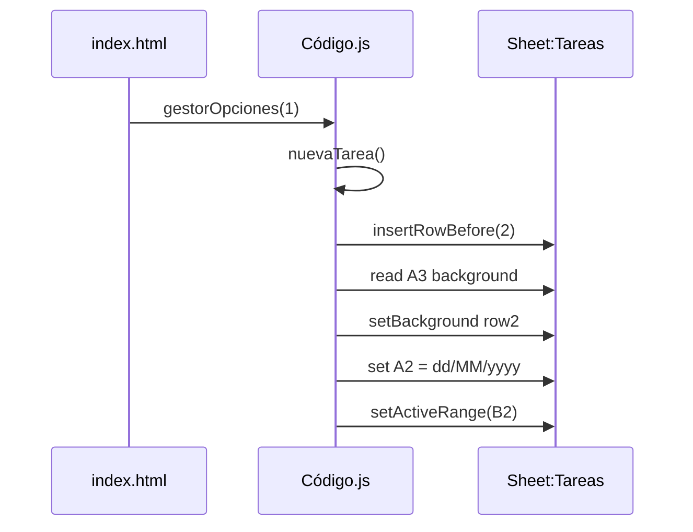
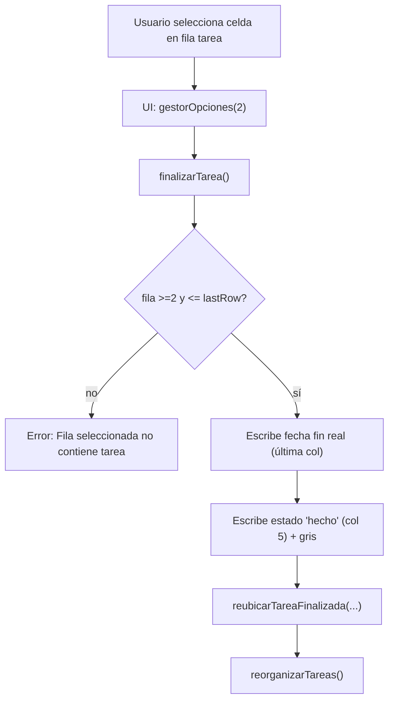
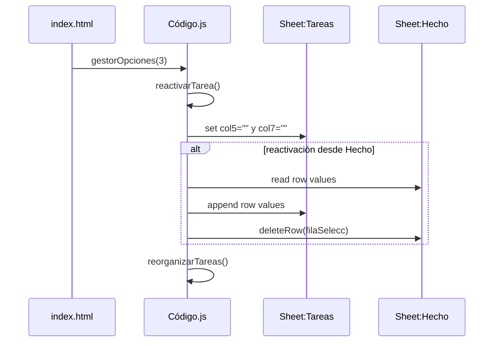
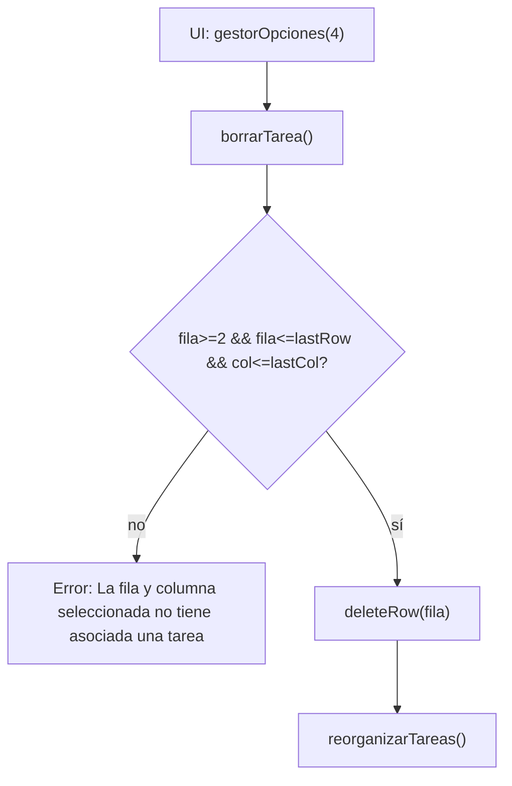
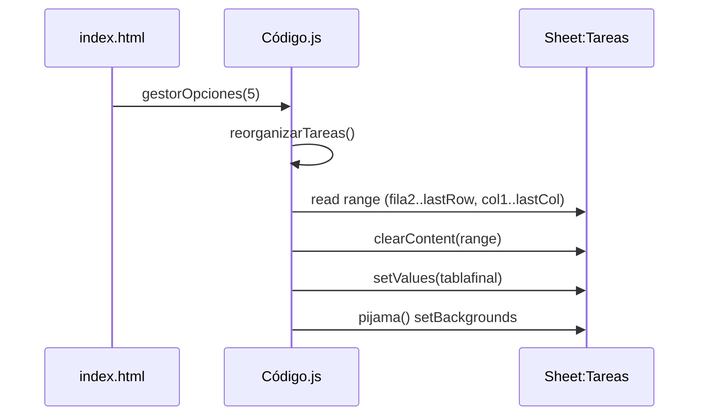
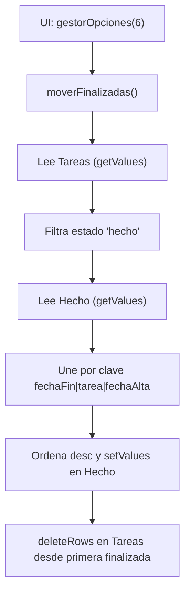
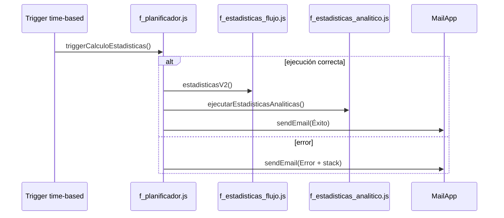

# Flujos de ejecución — Gestión_Tareas_Susi

## Referencias cruzadas

- Modelo de datos y columnas: ver `docs/DATA_MODEL.md`.
- Arquitectura e inventario: ver `docs/ARCHITECTURE.md`.
- Riesgos y límites: ver `docs/SECURITY.md` y `docs/TROUBLESHOOTING.md`.

## Contratos entre capas (plantilla única)

> Plantilla aplicada a funciones críticas. (UI → Router → Dominio/Datos o Batch → Datos)

### Contrato: `gestorOpciones(opcion)`

- **Capa**: Router (servidor GAS)
- **Ubicación**: `Código.js`
- **Propósito**: Punto de entrada único desde UI; enruta por `opcion` a operaciones de dominio.
- **Firma**: `gestorOpciones(opcion)`
- **Precondiciones**:
  - `opcion` debe ser entero esperado \(\in\{1,2,3,4,5,6\}\).
  - EVIDENCIA: `index.html` → `startAction(opcion)` → `startAction(1..6)` desde botones y llamada a `.gestorOpciones(opcion)`.
- **Lecturas**:
  - Lee `opcion` y selecciona caso.
  - EVIDENCIA: `Código.js` → `gestorOpciones(opcion)` → `switch (opcion)`.
- **Transformaciones**:
  - Mapeo `opcion → función`.
  - EVIDENCIA: `Código.js` → `gestorOpciones(opcion)` → `case 1: nuevaTarea(); ... case 6: moverFinalizadas();`.
- **Escrituras**: indirectas (las realiza la función destino).
- **Salida**: no retorna valor explícito; si error, lanza excepción para `withFailureHandler` en UI.
  - EVIDENCIA: `Código.js` → `gestorOpciones(opcion)` → `throw new Error(err.message)`.
- **Errores**:
  - `opcion` fuera de rango → `"Opción seleccionada no existe"`.
  - EVIDENCIA: `Código.js` → `gestorOpciones(opcion)` → `default: throw new Error("Opción seleccionada no existe")`.
- **EVIDENCIA**: `Código.js` → `gestorOpciones(opcion)` → `switch (opcion) { case 1..6 }`.

### Contrato: `finalizarTarea()`

- **Capa**: Dominio/Datos (servidor GAS)
- **Ubicación**: `Código.js`
- **Propósito**: Marcar una tarea como finalizada, escribir fecha fin real y estado, recolocar y reorganizar.
- **Firma**: `finalizarTarea()`
- **Precondiciones**:
  - Hoja `Tareas` existe.
  - El usuario tiene una celda activa dentro del rango de tareas (fila \(\ge 2\) y \(\le\) última fila).
  - EVIDENCIA: `Código.js` → `finalizarTarea()` → `hj_tareas.getActiveRange(); filaTarea = rngTarea.getRow(); if (filaTarea > filasTareas || filaTarea < 2) throw ...`.
- **Lecturas**:
  - `Tareas`: fila activa, última fila/columna, valor de fecha fin real en última columna.
  - EVIDENCIA: `Código.js` → `finalizarTarea()` → `getActiveRange()`, `getLastColumn()`, `getLastRow()`, `getRange(filaTarea, columnasTarea).getValue()`.
- **Transformaciones**:
  - Fecha fin real = hoy formateado `dd/MM/yyyy`.
  - Estado = `'hecho'`.
  - EVIDENCIA: `Código.js` → `finalizarTarea()` → `Utilities.formatDate(...,"dd/MM/yyyy")` y `setValue('hecho')`.
- **Escrituras**:
  - Última columna (fecha fin real), columna 5 (estado), background de la fila (gris).
  - EVIDENCIA: `Código.js` → `finalizarTarea()` → `getRange(filaTarea, columnasTarea).setValue(fechaFin)`; `getRange(filaTarea,5).setValue('hecho')`; `setBackground(rgbToHex(210,210,210))`.
- **Salida**: no retorna valor explícito.
- **Errores**:
  - Fila inválida: `"Fila seleccionada no contiene tarea"`.
  - Riesgo: `catch (error) { throw new Error(err.message); }` usa `err` no definido.
  - EVIDENCIA: `Código.js` → `finalizarTarea()` → `throw new Error("Fila seleccionada no contiene tarea")` y bloque `catch`.
- **EVIDENCIA**: `Código.js` → `finalizarTarea()` → escribe fecha fin y estado y llama `reubicarTareaFinalizada(...)` + `reorganizarTareas()`.

### Contrato: `reorganizarTareas()`

- **Capa**: Dominio/Datos (servidor GAS)
- **Ubicación**: `Código.js`
- **Propósito**: Reordenar todas las tareas de `Tareas` en 3 bloques (retrasadas/en curso/finalizadas), ordenar internamente y reescribir tabla; aplicar coloreado.
- **Firma**: `reorganizarTareas()`
- **Precondiciones**:
  - Hoja `Tareas` existe y tiene al menos cabecera.
  - EVIDENCIA: `Código.js` → `reorganizarTareas()` → `getSheetByName('Tareas'); ultimaFila = getLastRow(); getRange(2,1,ultimaFila-1,...)`.
- **Lecturas**:
  - `Tareas`: rango completo desde fila 2, columnas hasta `getLastColumn()`.
  - Fecha actual (`new Date().getTime()`).
  - EVIDENCIA: `Código.js` → `reorganizarTareas()` → `rngTareas.getValues(); fhDia = new Date().getTime()`.
- **Transformaciones**:
  - Partición en 3 listas por estado/fecha fin estimada (`elemento[4]`, `elemento[5]`).
  - Ordenación por prioridad y luego fecha (`ordenarTareas`).
  - EVIDENCIA: `Código.js` → `reorganizarTareas()` → `tblTareasRetrasadas/tblTareasCurso/tblTareasFinalizadas` + `ordenarTareas(...)`.
- **Escrituras**:
  - Limpia contenido del rango y reescribe `tablafinal` (concatenación de las 3 listas).
  - Aplica `pijama()` (backgrounds).
  - EVIDENCIA: `Código.js` → `reorganizarTareas()` → `rngTareas.clearContent(); rngTareas.setValues(tablafinal); pijama();`.
- **Salida**: no retorna valor explícito.
- **Errores**:
  - Si falla cualquier operación, re-lanza `err.message`.
  - EVIDENCIA: `Código.js` → `reorganizarTareas()` → `catch (err) { throw new Error(err.message); }`.
- **EVIDENCIA**: `Código.js` → `reorganizarTareas()` → partición + `setValues(tablafinal)` + `pijama()`.

### Contrato: `moverFinalizadas()`

- **Capa**: Dominio/Datos (servidor GAS)
- **Ubicación**: `Código.js`
- **Propósito**: Mover tareas con estado `'hecho'` desde `Tareas` a `Hecho`, evitando duplicados por clave y eliminando filas movidas.
- **Firma**: `moverFinalizadas()`
- **Precondiciones**:
  - Existen hojas `Tareas` y `Hecho`.
  - La tabla tiene al menos fila 1 cabecera.
  - EVIDENCIA: `Código.js` → `moverFinalizadas()` → `getSheetByName('Tareas')` y `getSheetByName('Hecho')`.
- **Lecturas**:
  - `Tareas`: `getRange(2,1,numfilas-1,numcolumnas).getValues()`.
  - `Hecho`: `getRange(2,1,numfilasHecho-1,numcolumnasHecho).getValues()`.
  - EVIDENCIA: `Código.js` → `moverFinalizadas()` → `vlTareas = rngTareas.getValues(); vlHecho = rngHecho.getValues();`.
- **Transformaciones**:
  - Filtra finalizadas por `elemento[numcolumnas - 3] == 'hecho'` (columna de estado calculada por tamaño de hoja).
  - Genera clave `fechaFinReal.getTime() | tarea | fechaAlta.getTime()` y une con existentes en `Hecho`.
  - Ordena por la clave (string) descendente: `new Map([...].sort().reverse())`.
  - EVIDENCIA: `Código.js` → `moverFinalizadas()` → filtro por `'hecho'`; construcción `claveIn` y `claveHch`; `sortedMap = new Map([...unionMap].sort().reverse())`.
- **Escrituras**:
  - `Hecho`: escribe todas las filas desde `Hecho!A2` con el resultado ordenado (`setValues`).
  - `Tareas`: borra en bloque desde primera finalizada detectada (`deleteRows(filaInicalTareaMov, ...)`).
  - EVIDENCIA: `Código.js` → `moverFinalizadas()` → `hjHecho.getRange(2,1,fila,numcolumnasHecho).setValues(...)` y `hjTareas.deleteRows(...)`.
- **Salida**: no retorna valor explícito.
- **Errores**:
  - Riesgo: dependencia de tipos `Date` (`getTime()`) en columnas 1 y 7; si llegan strings, error.
  - Riesgo: `catch (err) { throw new Error(error.message); }` referencia `error` no definido.
  - EVIDENCIA: `Código.js` → `moverFinalizadas()` → uso `getTime()` y bloque `catch`.
- **EVIDENCIA**: `Código.js` → `moverFinalizadas()` → unión `mapHch/mapIn` y `deleteRows(...)`.

### Contrato: `estadisticasV2()`

- **Capa**: Batch/Estadísticas (servidor GAS)
- **Ubicación**: `f_estadisticas_flujo.js`
- **Propósito**: Recalcular hoja `Estadisticas` con agregados semanales: nuevas, abiertas y cerradas.
- **Firma**: `estadisticasV2()`
- **Precondiciones**:
  - Spreadsheet activo accesible.
  - Datos en `Tareas` y `Hecho` con columnas requeridas (ver `docs/DATA_MODEL.md`).
  - EVIDENCIA: `f_estadisticas_flujo.js` → `prepararHojaEstadisticas()` → `tareas = obtenerDatosHoja("Tareas"); hechos = obtenerDatosHoja("Hecho");`.
- **Lecturas**:
  - `Tareas` y `Hecho` usando `getDisplayValues()` (strings).
  - EVIDENCIA: `f_estadisticas_flujo.js` → `obtenerDatosHoja()` → `return rango.getDisplayValues();`.
- **Transformaciones**:
  - Conteos por semana ISO (`obtenerSemanaISO`) para:
    - Nuevas: por fecha inicio (col A).
    - Cerradas: por fecha fin real (col G).
    - Abiertas: recorre semana a semana desde inicio hasta la semana actual si no hay fecha fin.
  - EVIDENCIA: `f_estadisticas_flujo.js` → `contarTareasNuevas()/contarTareasCerradas()/contarTareasAbiertasPorSemana()`.
- **Escrituras**:
  - Borra/crea hoja `Estadisticas`, escribe cabecera y valores desde fila 2.
  - Registra errores en `Errores_Estadisticas` (appendRow).
  - EVIDENCIA: `f_estadisticas_flujo.js` → `prepararHojaEstadisticas()` → `borrarHoja()/crearHoja(3)` + `setValues([cabeceras])`; `grabarEnHjEstadisticas()` → `setValues(valores)`; `registrarError()` → `appendRow(...)`.
- **Salida**: no retorna valor explícito (se basa en side-effects).
- **Errores**:
  - Se capturan y registran en hoja `Errores_Estadisticas`; el flujo no necesariamente falla duro si se capturan internamente.
  - Riesgo: duplicación de `grabarEnHjEstadisticas` (sobrescritura).
  - EVIDENCIA: `f_estadisticas_flujo.js` → `estadisticasV2()` → `catch (error) { registrarError("estadisticasV2", error); }` + definiciones duplicadas de `grabarEnHjEstadisticas`.
- **EVIDENCIA**: `f_estadisticas_flujo.js` → `estadisticasV2()` → secuencia `prepararHojaEstadisticas()` → conteos → `grabarEnHjEstadisticas(valores)`.

## Flujos UI (1..6)

### Flujo 1 — Nueva Tarea (`opcion=1`)

**Objetivo**: insertar una nueva fila en `Tareas` (fila 2), colorear “pijama” y asignar fecha alta en `A2`.

**Paso a paso técnico**:
1) UI llama `gestorOpciones(1)`.
   - EVIDENCIA: `index.html` → botón `Nueva Tarea` → `onclick="startAction(1)"` → `.gestorOpciones(opcion)`.
2) Router ejecuta `nuevaTarea()`.
   - EVIDENCIA: `Código.js` → `gestorOpciones(opcion)` → `case 1: nuevaTarea();`.
3) Inserta fila antes de la 2 y calcula color en función de fila siguiente.
   - EVIDENCIA: `Código.js` → `nuevaTarea()` → `insertRowBefore(2)` + `getRange(3,1).getBackground()`.
4) Colorea rango `A2:...` y escribe fecha alta `dd/MM/yyyy` en `A2`, activa `B2`.
   - EVIDENCIA: `Código.js` → `nuevaTarea()` → `getRange(2,1,1,num_columnas).setBackground(...)` + `setValue(fechaAlta)` + `setActiveRange(getRange(2,2))`.

**Lectura → Transformación → Escritura**:
- Lectura: background de `Tareas!A3`.
- Transformación: decide color (blanco/amarillo) y formatea fecha.
- Escritura: inserta fila 2; background y `A2`.

**APIs Apps Script**: `SpreadsheetApp`, `Session`, `Utilities`.
- EVIDENCIA: `Código.js` → `nuevaTarea()` → `Session.getScriptTimeZone(); Utilities.formatDate(...);`.

**Errores**:
- Se propaga `err.message` al cliente (sidebar) si se lanza `Error`.
  - EVIDENCIA: `Código.js` → `nuevaTarea()` → `catch (err) { throw new Error(err.message); }`.

### Flujo 2 — Finalizar Tarea (`opcion=2`)

**Objetivo**: marcar la fila activa como finalizada (estado `'hecho'` + fecha fin real), recolocar entre finalizadas y reorganizar.

**Paso a paso técnico**:
1) UI llama `gestorOpciones(2)` → `finalizarTarea()`.
   - EVIDENCIA: `index.html` → botón `Finalizar Tarea` → `startAction(2)`; `Código.js` → `case 2: finalizarTarea();`.
2) Valida que la fila activa esté entre 2 y última fila.
   - EVIDENCIA: `Código.js` → `finalizarTarea()` → `if (filaTarea > filasTareas || filaTarea < 2) throw ...`.
3) Escribe fecha fin real en la **última columna** y estado `'hecho'` en columna 5; colorea gris.
   - EVIDENCIA: `Código.js` → `finalizarTarea()` → `getRange(filaTarea, columnasTarea).setValue(fechaFin)` + `getRange(filaTarea,5).setValue('hecho')` + `setBackground(rgbToHex(210,210,210))`.
4) Reubica la tarea finalizada y reorganiza.
   - EVIDENCIA: `Código.js` → `finalizarTarea()` → `reubicarTareaFinalizada(...); reorganizarTareas();`.

**APIs Apps Script**: `SpreadsheetApp`, `Utilities`, `Session`.

**Errores / riesgos**:
- Riesgo operativo: `catch` lanza `err.message` pero captura `error`.
  - EVIDENCIA: `Código.js` → `finalizarTarea()` → `catch (error) { throw new Error(err.message); }`.

### Flujo 3 — Reactivar Tarea (`opcion=3`)

**Objetivo**: “deshacer” la finalización: limpiar estado/fecha fin real y, si se reactiva desde `Hecho`, mover la fila a `Tareas`.

**Paso a paso técnico**:
1) UI llama `gestorOpciones(3)` → `reactivarTarea()`.
   - EVIDENCIA: `index.html` → `startAction(3)`; `Código.js` → `case 3: reactivarTarea();`.
2) Obtiene hoja activa por nombre `Tareas` (no usa `getActiveSheet()`), luego calcula fila/col seleccionada.
   - EVIDENCIA: `Código.js` → `reactivarTarea()` → `getSheetByName('Tareas')` + `getActiveCell().getRow()/getColumn()`.
3) Limpia columna 5 (estado) y 7 (fecha fin real).
   - EVIDENCIA: `Código.js` → `reactivarTarea()` → `getRange(filaSelecc, 5).setValue("")` y `getRange(filaSelecc, 7).setValue("")`.
4) Si hoja activa es `Hecho`, copia valores (hasta `ultColumHjActiva - 1`) a última fila de `Tareas` y borra la fila en `Hecho`.
   - EVIDENCIA: `Código.js` → `reactivarTarea()` → `if (nbHjActiva === 'Hecho') ... setValues(vlModif) ... deleteRow(filaSelecc)`.
5) Llama `reorganizarTareas()`.
   - EVIDENCIA: `Código.js` → `reactivarTarea()` → `reorganizarTareas();`.

**Riesgos**:
- Inconsistencia: `catch (err) { throw new Error(error.message); }` usa `error` no definido; `SpreadsheetApp.flush` sin `()`.
  - EVIDENCIA: `Código.js` → `reactivarTarea()` → `throw new Error(error.message)` y `SpreadsheetApp.flush;`.

### Flujo 4 — Borrar Tarea (`opcion=4`)

**Objetivo**: borrar la fila activa en `Tareas` (si está dentro del rango) y reorganizar.

**Paso a paso técnico**:
1) UI llama `gestorOpciones(4)` → `borrarTarea()`.
   - EVIDENCIA: `index.html` → `startAction(4)`; `Código.js` → `case 4: borrarTarea();`.
2) Valida que fila >=2 y <= lastRow y que columna <= lastColumn.
   - EVIDENCIA: `Código.js` → `borrarTarea()` → `if (filaTarea > 1 && filaTarea <= ultFila && columTarea <= ultColumn)`.
3) `deleteRow(filaTarea)` y `reorganizarTareas()`.
   - EVIDENCIA: `Código.js` → `borrarTarea()` → `deleteRow(filaTarea); reorganizarTareas();`.

### Flujo 5 — Reorganizar Tareas (`opcion=5`)

**Objetivo**: ejecutar manualmente `reorganizarTareas()` (ver contrato arriba).
- EVIDENCIA: `Código.js` → `gestorOpciones(opcion)` → `case 5: reorganizarTareas();`.

### Flujo 6 — Mover Finalizados (`opcion=6`)

**Objetivo**: ejecutar `moverFinalizadas()` (ver contrato arriba).
- EVIDENCIA: `Código.js` → `gestorOpciones(opcion)` → `case 6: moverFinalizadas();`.

## Flujo batch — Trigger de estadísticas

**Objetivo**: ejecución programada que recalcula estadísticas y envía email de éxito/error.

**Secuencia**:
1) Un trigger time-based ejecuta `triggerCalculoEstadisticas()`.
   - EVIDENCIA: `f_planificador.js` → `crearTriggerCalculoEstadisticas()` → `newTrigger('triggerCalculoEstadisticas').timeBased()...create()`.
2) `triggerCalculoEstadisticas` ejecuta `estadisticasV2()` y luego `ejecutarEstadisticasAnaliticas()`.
   - EVIDENCIA: `f_planificador.js` → `triggerCalculoEstadisticas()` → `estadisticasV2(); ejecutarEstadisticasAnaliticas();`.
3) Envía email con resultado.
   - EVIDENCIA: `f_planificador.js` → `triggerCalculoEstadisticas()` → `MailApp.sendEmail(destinatario, asunto, cuerpo)`.

**Errores**:
- El email siempre se envía (salvo fallo en `MailApp`) con asunto de éxito/error.
  - EVIDENCIA: `f_planificador.js` → `triggerCalculoEstadisticas()` → bloque `try/catch` y `MailApp.sendEmail(...)`.

